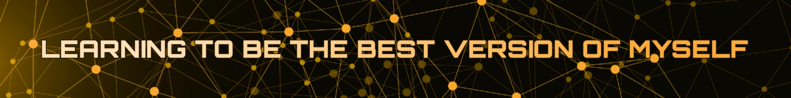

<p align="center">
  
</p>

<div align="center" style="text-align: center">
  <a href="https://alan-k-biju.github.io/Alan-K-Biju_Portfolio/" target="_blank" rel="noopener noreferrer">
    
  </a>

  [](https://git.io/typing-svg)

  [My Resume 🇮🇳](https://docs.google.com/document/d/195tLQi_MrL3lDW_EkHFAp-OesJnB16zt5ISKzWX9bb4/edit?usp=sharing) ⬅️➡️
  [എന്റെ ബയോഡേറ്റ 🇮🇳](https://docs.google.com/document/d/195tLQi_MrL3lDW_EkHFAp-OesJnB16zt5ISKzWX9bb4/edit?usp=sharing)
</div>

<p align="center">
    
    
</p>

<div style="text-align: center">

[](https://git.io/typing-svg)

<div>
  <p align="center">
    <a href="https://skillicons.dev">
      <
    </a>
  </p>
</div>

[](https://git.io/typing-svg)

<div>
  <p align="center">
    <a href="https://skillicons.dev">
      
    </a>
  </p>
</div>

<br>

<!--  -->

```js
const AlanKBiju = {
  about: [
    '👨‍💻 Full Stack Developer passionate about Web, Mobile, DevOps, and Machine Learning.',
    '🚀 Currently exploring cloud-native architectures and AI-powered applications.',
    '🧑‍🏫 Mentor and lifelong learner, focused on clean code and scalable systems.',
    '📚 Avid reader of tech docs, research papers, and practical guides.',
    '⚙️ Skilled with Java, Kotlin, Python, React, AWS, Docker, and more.',
    '💡 Interested in optimizing workflows, CI/CD pipelines, and developer experience.',
    '🌐 Enthusiastic about open source and community-driven projects.',
    '📱 Building cross-platform apps using Flutter and Android Studio.',
    '🔧 Maintaining and automating infrastructure using Ansible, Kubernetes, and Jenkins.',
    '🧠 Experimenting with ML frameworks like TensorFlow, PyTorch, and scikit-learn.'
  ],
  futureLearningGoals: [
    '🧪 Anaconda for data science and ML environments.',
    '📱 Android Studio & Flutter for mobile app dev.',
    '🛠️ Ansible and Kubernetes for infrastructure automation.',
    '☁️ AWS cloud services including DynamoDB, Lambda, and EC2.',
    '⚡ Babel, Gradle, Maven for build automation.',
    '🐚 Bash scripting for DevOps efficiency.',
    '🖥️ Docker and Docker Compose for containerization.',
    '🚀 FastAPI and Flask for backend APIs.',
    '🗃️ PostgreSQL, MongoDB, and DynamoDB for databases.',
    '🧩 GraphQL for flexible APIs.',
    '📊 Grafana and Prometheus for monitoring.',
    '🤖 TensorFlow, PyTorch, scikit-learn for machine learning.',
    '🧪 Tauri for building lightweight desktop apps.',
    '🌐 Next.js and React for modern web apps.',
    '📦 NPM and GitHub Actions for CI/CD automation.',
    '🐍 Python and Kotlin programming languages.'
  ]
};

```

</div>

---

<h2 align="center">Curious about my toolkit and mindset? 🤔</h2>

<p align="center"> Here are some questions I love to explore, based on different engineering domains. What are yours? 🚀</p>

#### 📖 = Things I'm currently exploring...

<details>
  <summary>🌐 For Web Developers:</summary>
    <ul align='left'>
      <li>🤔 How can modern frameworks like React and Next.js be optimized for performance and SEO?</li>
      <li>🤔 What are the best practices for managing state in complex SPAs?</li>
      <li>🤔 How to architect scalable microfrontend applications?</li>
      <li>🤔 How do CSS-in-JS libraries compare with traditional CSS and utility-first frameworks?</li>
      <li>🤔 How can automation and CI/CD pipelines improve frontend deployment?</li>
    </ul>
</details>

<details>
<summary>📱 For Mobile Developers:</summary>
    <ul align='left'>
      <li>🤔 What are the trade-offs between native development (Kotlin/Java, Swift) and cross-platform frameworks (Flutter, React Native)?</li>
      <li>🤔 How to architect scalable, maintainable mobile apps with clean MVVM or MVI patterns?</li>
      <li>🤔 How to optimize app performance and battery consumption?</li>
      <li>🤔 What are effective strategies for offline-first mobile applications?</li>
      <li>🤔 How to integrate CI/CD pipelines for automated mobile app testing and deployment?</li>
    </ul>
</details>

<details>
  <summary>⚙️ For DevOps Engineers:</summary>
    <ul align='left'>
      <li>🤔 How to design infrastructure-as-code workflows using Ansible and Terraform?</li>
      <li>🤔 What are the key principles of container orchestration with Kubernetes?</li>
      <li>🤔 How to implement monitoring and alerting with Prometheus and Grafana?</li>
      <li>🤔 How to build resilient CI/CD pipelines with Jenkins, GitHub Actions, and GitLab CI?</li>
      <li>🤔 What are the security best practices for cloud-native applications?</li>
    </ul>
</details>

<details>
  <summary>🤖 For Machine Learning Engineers</summary>
    <ul align='left'>
      <li>🤔 How to select the right ML framework: TensorFlow, PyTorch, or scikit-learn?</li>
      <li>🤔 What are effective techniques for model deployment and serving in production?</li>
      <li>🤔 How to design pipelines for continuous training and model monitoring?</li>
      <li>🤔 How to integrate ML workflows with existing data engineering pipelines?</li>
      <li>🤔 What are practical approaches for explainability and interpretability of ML models?</li>
    </ul>
</details>

---

<div style="text-align: center">

<br>

<p align="center">
  
</p>

<p align="center">
  
</p>
  
<p align="center">
    
</p>
### 🌐 Connect With Me

<p align="center">
  <a href="www.linkedin.com/in/alan-k-biju/" target="_blank">
    
  </a>
  &nbsp;&nbsp;&nbsp;
  <a href="mailto:alankorethbiju@gmail.com">
    
  </a>
  <a href="https://leetcode.com/u/ALAN_K_BIJU" target="_blank">
    
  </a>
</p>
  
  

</div>
